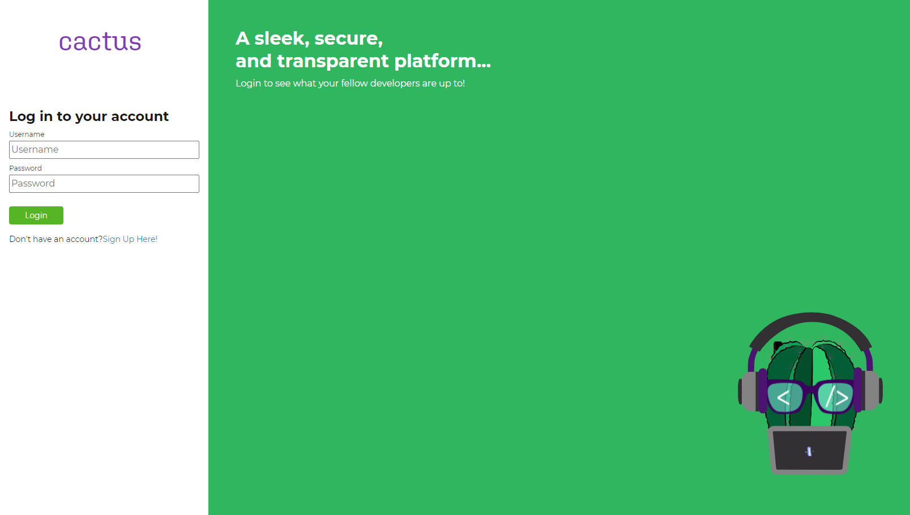
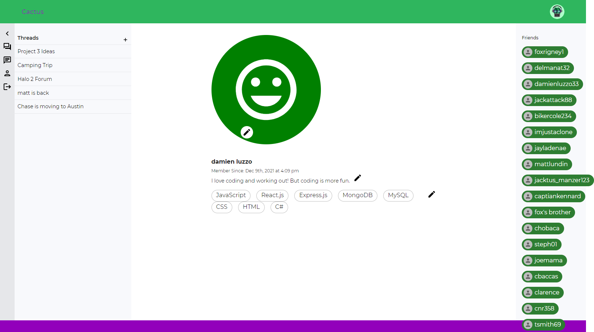
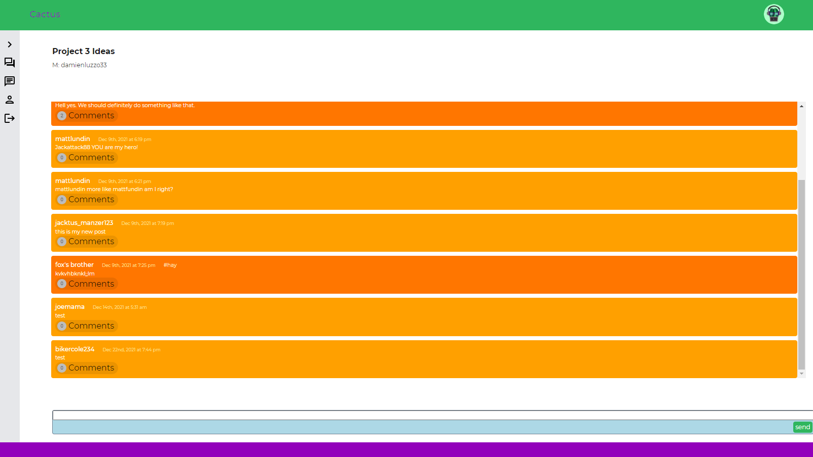
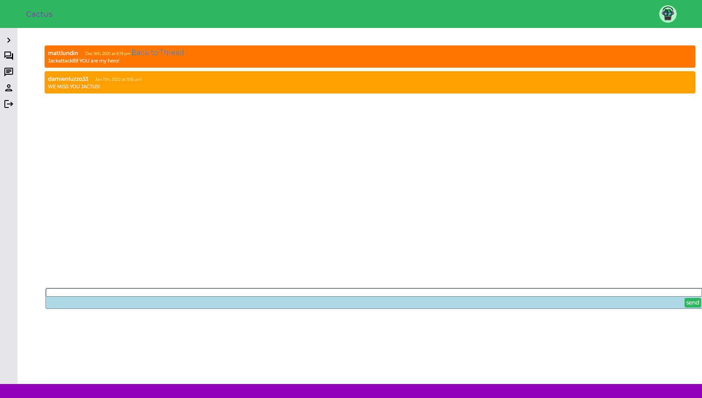
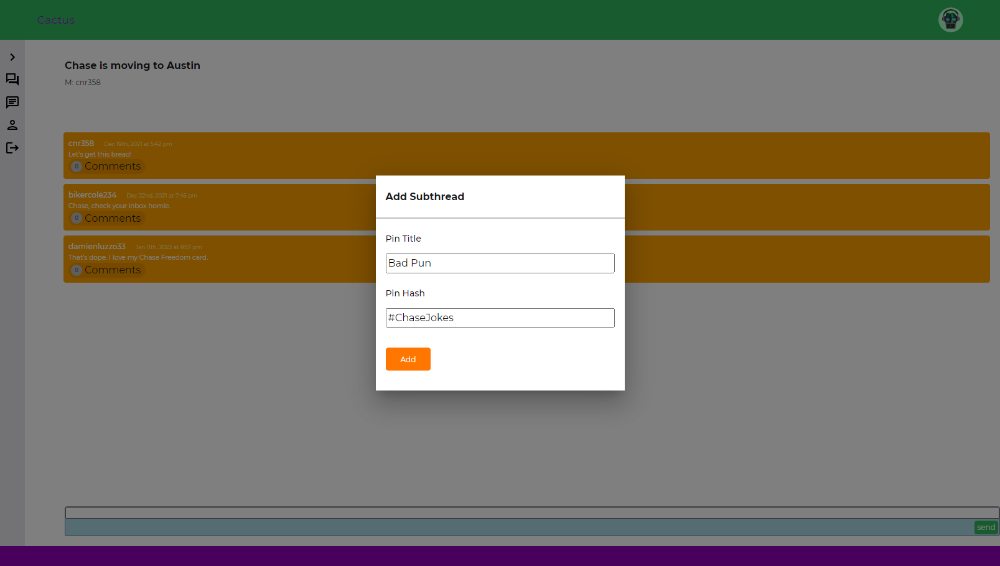
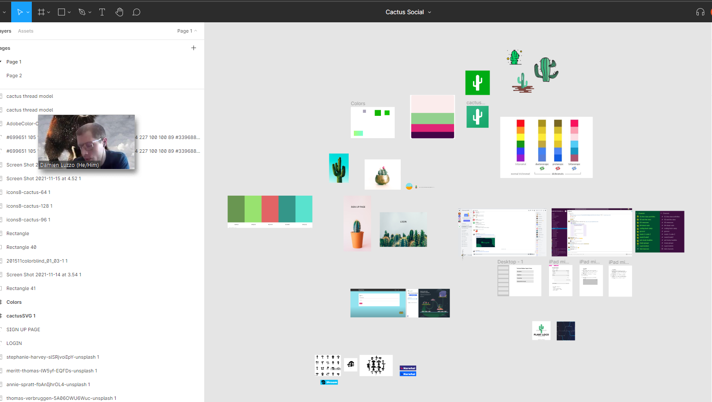
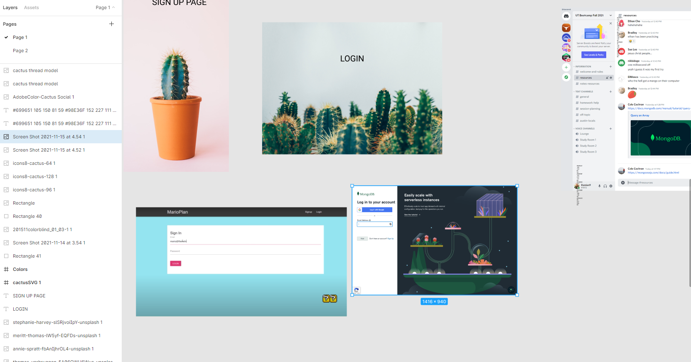

# Cactus Social

Version 1.1.0

[Link To Deployed Application](https://cactus-social.herokuapp.com/)

Original Deployment Date : December 8, 2021

Current Version Deployment Date: December 12th, 2021

 

<!-- GIF DEMO OF APPLICATION COMING SOON-->

--- 

 

## Mission Statement

A sleek, secure, and transparent social media platform for web developers.

 

---

 

## Description

In today's world, it's hard to find a single person who owns a computer and doesn't have at least one social media account. Twitter, Facebook, LinkedIn, and TikToc have become staples for today's internet users. Their existence has completely changed how we as humans communicate with one another, sometimes for the better, but other times for the worst. Monetized algorithms now determine how users are able to interact with information feeds on daily basis; People are become more and more fixated on their online social presence, and less focused on actual human interaction; Social media is completely warping how individuals view themselves, how they value themselves, and what they now aspire to be as people. It's changing how we treat one another; And it's changing how we treat ourselves. In short, social media has become a toxic disease that continues to efficiently warp the minds of their users. 

For those who've broken free from the chains of mainstream social media platforms, we've yet to find refuge with any suitable alternative. And that's exactly why we made Cactus Social - to provide individuals with the functionality they need to effectively and efficiently communicate with one another - without the toxic fluff. Tired of computer algorithms telling you what populates on your news feed or timeline? Sick of the payed advertisements and posts taking over news about your friends? Are you ready for something just as elegant as Twitter and Slack without the complicated user interface? Then welcome to Cactus Social.

 

---

 

## Current State of Application

While Cactus Social aspires to one day serve the broader population of internet users, it is being launched as a platform to serve the social needs of software developers. Like LinkedIn, you'll be able to build a profile that prospective employers, friends, and connections can easily view and learn about you. Like Facebook, you'll be able to view public announcements, browse public events, and connect with friends. Like Slack and Discord, you'll be able to join or moderate threads, add formatted posts and comments, and react to posts. And like Signal, you'll be able to connect with a friend or a group of friends securely in complete privacy. 

If you are interested in improving or modifying this application in any way, please contact one of the original contributor using the contact information provided in the contact section below.

 

---

 

## The Cactus Social Team
 

> Development Team: 

- Damien Luzzo
- Cole Cochran
- Fox Rigney
- Stephanie Cortez
- Ethan Cho
- Ismeny Castro
- Jayla De'nae

> Design Support Team

- Jack Manzer
- Ari Newman

 

---

 

## Table of Contents

- [Installation](#installation)
- [Usage](#usage)
- [Instructions](#instructions)
- [Credits](#credits)
- [License](#license)
- [Features](#features)
- [Contributors](#contributors)

 

---

## Installation

 

Visit the deployed application linked above and create your new account! 

*NOTE: In the very near future, users will have the ability to download the application onto their desktops and phones.*

 

---

 

## Usage

To get started, simply visit the deployed application (linked at the top of this README) and sign up for a new account!

<!-- video of splashpage -->

 

---

 

## Instructions

 

### Signup

- Create a user account with Cactus Social by filling out the necessary fields: fist and last name, email, username, and password.

<!-- image of usercreation button and usercreation page -->

- Now you have access to our sleek messaging and editing features, as well as your own personal profile page!

### Profile Page

- On the profile page, you'll be able to edit your profile picture, add a short bio, and provide information about the skills and technologies that you as a developer currently have.

<!-- picture of the profile page -->

### App Navigation

- The buttons on the left side of the screen will halp you navigate throughout the site. You can view all of your available threads and create new ones, you can hit up the secure direct messenger application, you can navigate back to your user profile, and you can logout at any time.

<!-- gif showing the various functionality of the side panel -->

- The icon at the top right will allow you to navigate with ease to your most important features including: visiting your profile, entering the direct messenger, and logging out of your account.

<!-- gif demonstrating the use of the profile icon -->

### Threads, Posts, and Comments

- When you navigate to an existing thread, you'll have the ability to add and pin posts, and to view comments for a given post. You'll similarly have the ability to add your own comments to posts.

<!-- gif of creating post, pinning post, and commenting on post -->

### Login

- Once you have your account created, you can come back to the page and log in anytime using the username and password that you created.

<!-- Gif demo of logging into the site -->

### Direct Messenger

- Best of all, you'll have access to our secure direct messenger where you can stay in touch with friends and start conversations with any of your connections.

<!-- Gif of the direct messenger in action -->

 

*NOTE: You must be logged in to access anything on Cactus Social besides the login page, sign up page, and the splash page.*

That is all there is to it. Enjoy your time on Cactus Social!

 

---

 

## Credits

 

- MongoDB 
- Express.js 
- React.js
- Node.js 
- Weavy
- Mongoose 
- React Router
- GraphQL
- Apollo
- Bcrypt
- MUI

 

---

 

## Features

 

### Users can:

- Create and update their profile information including their bio and tech-stack
- See all threads and create a new thread
- Access thread posts, pin posts, and create new posts
- View all comments for a given post and add their own comments
- Access the direct messenger, start new chats, and post in chats
- View the profiles of other users in their network
- Sign up, login, and logout of the application

 

---

 

## Screenshots

<!-- Login page -->
#### Login Page

<!-- Profile being updated -->
#### Profile Page

<!-- Thread with sidebar open -->
#### Thread With Posts

<!-- Post with comments and icon pressed -->
#### Posts With Comments

<!-- Post being pinned -->
#### Pinned Post Modal

 

---

 

### Current Contributors

Damien Luzzo: [Damien's GitHub](https://github.com/damienluzzo33) 
Cole Cochran: [Cole's GitHub](https://github.com/cole-cochran) 
Fox Rigney: [Fox's GitHub](https://github.com/foxrigney) 
Stephanie Cortez: [Stephanie's GitHub](https://github.com/CortezStephanie) 
Ethan Cho: [Ethan's GitHub](https://github.com/echo1826) 
Ismeny Castro: [Ismeny's GitHub](https://github.com/Ismeny) 
Jayla De'nae: [Jayla's GitHub](https://github.com/jayladenae)

 

### Past Contributors

Jack Manzer: [Jack's GitHub](https://github.com/jackmanzer) 
Nathan Delman: [Nathan's GitHub](https://github.com/Delmanat3)
 

---

 

## License

+ MIT

 

---

 

## Original Idea

 

<!-- figma 1 -->

*The idea was to build out the pages and components in figma as well as work on logo and front end design*
<!-- figma 2 -->

*Examples of sign up, login, error pages, and dashboard*

 

---

 

## Ideas for future development:

 

- Allow users to send and accept friend requests
- Restrict users to only see threads they have joined or created 
- Let users further personalize their profile page 
- Allow users to create, attend (or leave), delete, update, make public (or private), and post about events.
- Add functionality to delete a thread and to update and/or delete posts and comments
- Allow users to add emoji reactions to posts and comments
- Set up proper user access to direct messenger
- Add more artwork and logos to application
- Add additional layers of security
- Add slash commands and formatting options for posts and comments
- Get the image part of everything working - for 

 

---

 

## How To Contribute
Have additional ideas for improving this site? Please first discuss the change you wish to make via email with the owners of this repository. Email addresses can be found on the contributor's gitHub pages (links above).

 

---